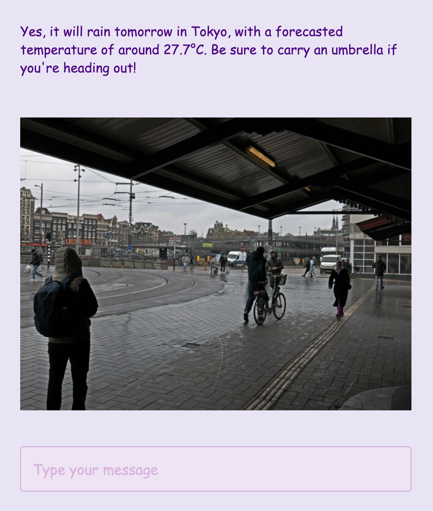

openai-structured-output-sample
==========

A sample application to demonstrate how to use [Structured Outputs](https://openai.com/index/introducing-structured-outputs-in-the-api/) in **OpenAI Chat Completions API** _with streaming_, built using [Next.js](https://nextjs.org/docs).

---

**OpenAI Chat Completions API**でストリーミングを使用した[Structured Outputs](https://openai.com/index/introducing-structured-outputs-in-the-api/)の利用方法を示すサンプルアプリケーション。[Next.js](https://nextjs.org/docs)で構築されています。

# Motivation

There are two ways to use structured output in the API:

1. **Tool Schema**: Set the output format based on the tool's schema. This is useful when the API itself completes or provide values for specific fields.

2. **Response Format**: Use the new `response_format` parameter to define a JSON schema for the desired output, independent of the tool's format. Previously, this is difficult to achieve if you are using function calling.

We'll be doing the latter and up the ante with streaming. But how can we stream text if the API output is in JSON format?

---

APIでStructured Outputを使用する方法は2つあります：

1. **ツールスキーマ**：ツールのスキーマに基づいて出力フォーマットを設定します。これは、API自体が特定のフィールドに値を補完または提供する場合に有用です。

2. **レスポンスフォーマット**：`response_format`という新しいパラメータを使用して、ツールのフォーマットに依存しない、希望する出力のJSONスキーマを定義します。以前は、関数呼び出しを使用している場合、これを実現するのは困難でした。

今回は後者を使用し、ストリーミングを加えてさらにレベルアップします。しかし、APIの出力がJSON形式の場合、どのようにテキストをストリーミングできるでしょうか？

# Screenshot

Prompt:
> will it rain tomorrow in tokyo?

<picture>
 <source media="(prefers-color-scheme: dark)" srcset="./docs/screenshot-dark.png">
 <source media="(prefers-color-scheme: light)" srcset="./docs/screenshot-light.png">
 
</picture>

# Setting up Streaming

**Vercel**, the maker of Next.js, has [AI SDK](https://sdk.vercel.ai/docs/introduction), a helper toolkit for AI-powered applications in Next.js, etc. but we will not be using it. We will just use [ReadableStream](https://developer.mozilla.org/en-US/docs/Web/API/ReadableStream) for simplicity.


## Client-side

To setup streaming in the client-side

```javascript
const handleSubmit = React.useCallback(async () => {

  // get previous limited number of messages as context
  const context = messages.slice(-MAX_TURN).map((a) => ({ role:a.role, content:a.content }))
  
  // create user message and add to state variable
  const user_message = {
    id: SimpleId(),
    created_at: Date.now(),
    role: 'user',
    content: messageInput
  }

  setMessages((prev) => [...prev, user_message])

  // we will be sending the context and message separately
  const response = await fetch('/api/stream/', {
      method: 'POST',
      headers: {
          'Content-Type': 'application/json',
      },
      body: JSON.stringify({
          context: context,
          message: user_message.content // just the text content
      })
  })

  const reader = response.body.getReader()

  // generate message id for assistant message and add assistant message to the state variable
  const assistant_id = SimpleId()

  setMessageOutput('')
  
  const assistant_message = {
      id: assistant_id,
      created_at: Date.now(),
      role: 'assistant',
      content: '' // blank for now
  }

  setMessages((prev) => [...prev, assistant_message])

  let is_completed = false

  while(!is_completed) {

    const { done, value } = await reader.read()

    if(done) {
        is_completed = true
        break
    }

    const raw_delta = new TextDecoder().decode(value)

    // send raw text to the message output state variable for display
    setMessageOutput((a) => a + raw_delta)

    // update assistant message in the main message state variable
    setMessages((prev) => 
      prev.map((a) => a.id !== assistant_id ? a : {...a, content: a.content + raw_delta})
    )

  }

}
```

Please note that this is not the most efficient way to do a chatbot.
Here we are always sending the context from the client-side.
In production, you need to setup some session variable to hold and manage your context in server-side.


## Server-side

To setup streaming in server-side using route handler

[/app/api/stream/route.js](/src/app/api/stream/route.js)
```javascript
export async function POST(request) {

  // receive POST body parameter from client-side
  let { message, context } = await request.json()

  // minimalist system prompt with current datetime
  // please note that it will include timezone which will be used as default location value
  // if you do not provide any
  let system_prompt = `You are a helpful assistant.\n` +
    `Today is ${new Date()}.`

  let messages = [
    { role: "system", content: system_prompt }
  ]

  if(context.length > 0) {
    messages = [...messages, ...context]
  }

  messages.push({ role: "user", content: message })

  return new Response(new ReadableStream({
    async pull(controller) {

      const stream = await openai.chat.completions.create({
        model: "gpt-4o-mini-2024-07-18",
        messages: messages,
        stream: true,
        temperature: 0.2,
      })

      for await (const chunk of stream) {
        if(chunk.choices[0].delta.content) {

          // send text chunk to client-side
          controller.enqueue(chunk.choices[0].delta.content)

        }
      }

      // close stream
      controller.close()

    }
  }), {
    status: 200,
    headers: {
      'Content-Type': 'text/event-stream'
    }
  })

}
```

We have not yet added any tools nor response_format parameters.
We are just setting up basic streaming and see that it works.


# Tools & Mock API

We will be using 2 tools

[get_weather](/src/assets/get_weather.json)
```javascript
{
  "type": "function",
  "function": {
    "name": "get_weather",
    "description": "Get the weather forecast for a location on a given date.",
    "parameters": {
      "type": "object",
      "properties": {
        "location": {
          "type": "string",
          "description": "The name of city or place."
        },
        "date": {
          "type": "string",
          "description": "The date in YYYY-MM-DD format."
        }
      },
      "required": ["location", "date"],
      "additionalProperties": false
    }
  },
  "strict": true
}
```

[get_events](/src/assets/get_events.json)
```javascript
{
  "type": "function",
  "function": {
    "name": "get_events",
    "description": "Get events for a location on a given date.",
    "parameters": {
      "type": "object",
      "properties": {
        "location": {
          "type": "string",
          "description": "The name of city or place."
        },
        "date": {
          "type": "string",
          "description": "The date in YYYY-MM-DD format."
        }
      },
      "required": ["location", "date"],
      "additionalProperties": false
    }
  },
  "strict": true
}
```

To handle the tools, we made a mock API using Promise to simulate remote API call.

[mockapi.js](/src/lib/mockapi.js)
```javascript
export function mockApiCall(name, args) {

  let data = {...args}

  if(name === 'get_weather') {

    data.status = 'success'

    ...

  } else if(name === 'get_events') {

    data.status = 'success'
    data.events = []

    ...

  } else {
    data.status = 'error',
    data.message = `tool ${name} not found`
  }

  return new Promise((resolve, reject) => {
      const delay = Math.floor(1000 * Math.random()) // simulate delay
      setTimeout(() => {
      const success = true
      if (success) {
        resolve({ data })
      } else {
        reject(new Error('Mock API call failed'))
      }
    }, delay)
  })
}
```


# Response Format

Here is our response format schema.

[response_format](/src/assets/response_format.json)
```javascript
{
  "type": "json_schema",
  "json_schema": {
    "name": "message_response",
    "strict": true,
    "schema": {
        "type": "object",
        "properties": {
          "message": {
            "type": "string",
            "description": "The main text content of the response in markdown format."
          },
          "images": {
            "type": "array",
            "description": "List of images included in the response.",
            "items": {
              "type": "object",
              "properties": {
                "url": {
                  "type": "string",
                  "description": "The URL of the image."
                },
                "alt": {
                  "type": "string",
                  "description": "The alt-text for the image."
                }
              },
              "required": ["url", "alt"],
              "additionalProperties": false
            }
          },
          "tools": {
            "type": "array",
            "description": "Tools invoked to generate the response.",
            "items": {
              "type": "object",
              "properties": {
                "tool": {
                  "type": "object",
                  "properties": {
                    "name": {
                      "type": "string",
                      "description": "The name of the tool."
                    },
                    "output": {
                      "type": "string",
                      "description": "The output from tool in JSON string."
                    }
                  },
                  "required": ["name", "output"],
                  "additionalProperties": false
                }
              },
              "required": ["tool"],
              "additionalProperties": false
            }
          }
        },
        "required": ["message", "images", "tools"],
        "additionalProperties": false
    }
  }
}
```

We have 3 main parameters: `message`, `images` and `tools`.

**message** holds the main text response in markdown format which we will be displaying.

**images** should hold all the image output from various tools. We will then display it separate from the text.

As for the **tools**, one of the written [limitations of structured outputs](https://openai.com/index/introducing-structured-outputs-in-the-api/) is:

> Structured Outputs is not compatible with parallel function calls. When a parallel function call is generated, it may not match supplied schemas. Set parallel_tool_calls: false to disable parallel function calling.

Parallel function call is when more than one tool is invoked. It can be the same tool or different tools.
We will be using the **tools** parameter to [circumvent the limitation](#structured-outputs-for-parallel-function-calling).


# Handling Function Calling in Server-Side

One of the many mistake that beginners make is to assume that everything will be handled in one API call.
Because of the unpredictability of user message, it can happen that several calls might be needed.

To illustrate, check this code pattern
```javascript
let tool_calls = []

// 1. First api call
const stream = await openai.chat.completions.create({
    model: "gpt-4o-mini-2024-07-18",
    messages: messages,
    tools: tools,
    response_format: response_format,
    stream: true,
    temperature: 0.2,
})

for await (const chunk of stream) {
  if(chunk.choices[0].delta.content) {

    tool_content += chunk.choices[0].delta.content
    controller.enqueue(chunk.choices[0].delta.content)

  }

  if(chunk.choices[0].delta.tool_calls) {

    chunk.choices[0].delta.tool_calls.forEach((tool) => {
      if(tool_calls[tool.index]) {
        tool_calls[tool.index].function.arguments += tool.function.arguments
      } else {
        tool_calls[tool.index] = {
          id: tool.id,
          function: tool.function
        }
      }
    })

  }

  if(chunk.choices[0].finish_reason) {
    // 
  }

}

// 2. check tool_calls.length or finish_reason = 'tool_calls'
if(tool_calls.length === 0) {
  controller.close()
}

// 3. process tools invoked
...

// 4. update messages
...

// 5. submit everything back for 2nd api call
stream = await openai.chat.completions.create({
    model: "gpt-4o-mini-2024-07-18",
    messages: messages,
    tools: tools,
    response_format: response_format,
    stream: true,
    temperature: 0.2,
})

for await (const chunk of stream) {
  if(chunk.choices[0].delta.content) {

    tool_content += chunk.choices[0].delta.content
    controller.enqueue(chunk.choices[0].delta.content)

  }

  if(chunk.choices[0].delta.tool_calls) {

    chunk.choices[0].delta.tool_calls.forEach((tool) => {
      if(tool_calls[tool.index]) {
        tool_calls[tool.index].function.arguments += tool.function.arguments
      } else {
        tool_calls[tool.index] = {
          id: tool.id,
          function: tool.function
        }
      }
    })

  }

  if(chunk.choices[0].finish_reason) {
    // 
  }

}

// 6. Repeat step 2 until no more tools or finish_reason is not tool_calls

```

To handle this better, we will be using a **do while** loop to process function calling and wait until it ends (i.e. when there is no more tools invoked).

```javascript
let is_completed = false
let tool_calls = []
let tool_content = ''

do {

  let message_items = messages

  // tool processing
  if (Object.keys(tool_calls).length > 0) {
    
    let tool_message = { role: 'assistant', content: tool_content || null, tool_calls: [] }
    let tool_outputs = []

    for(let i = 0; i < tool_calls.length; i++) {

      let tool_id = tool_calls[i].id
        
      try {

        tool_message.tool_calls.push({
          id: tool_id,
          type: 'function',
          function: tool_calls[i].function
        })

        const tool_name = tool_calls[i].function.name
        const tool_args = JSON.parse(tool_calls[i].function.arguments)

        let tool_output = { status: 'error', name: tool_name, message: 'tool not found' }

        try {

          const response = await mockApiCall(tool_name, tool_args)
          tool_output = { ...tool_args, ...response.data }
            
        } catch(e) {
            console.log(e.message)
        }

        tool_outputs.push({
          tool_call_id: tool_id,
          role: 'tool',
          name: tool_name,
          content: JSON.stringify(tool_output)
        })

      } catch(e) {
        console.log(e.message)
      }

    }

    // update message
    message_items.push(tool_message)

    tool_outputs.forEach((tool_output) => {
      message_items.push(tool_output)
    })

  }

  // api call
  const stream = await openai.chat.completions.create({
    model: "gpt-4o-mini-2024-07-18",
    messages: message_items,
    tools: tools,
    response_format: response_format,
    stream: true,
    temperature: 0.2,
  })

  // check stream response
  for await (const chunk of stream) {
    if(chunk.choices.length > 0) {

      // handle text response, send to client-side immediately
      if(chunk.choices[0].delta.content) {
        tool_content += chunk.choices[0].delta.content
        controller.enqueue(chunk.choices[0].delta.content)
      }

      // handle tool response
      if(chunk.choices[0].delta.tool_calls) {
        chunk.choices[0].delta.tool_calls.forEach((tool) => {
          if(tool_calls[tool.index]) {
            tool_calls[tool.index].function.arguments += tool.function.arguments
          } else {
            tool_calls[tool.index] = {
              id: tool.id,
              function: tool.function
            }
          }
        })
      }

      if(chunk.choices[0].finish_reason) {
        //
      }

    }
  }
  
  // Exit loop if no tools invoked.
  if(tool_calls.length === 0) {
      is_completed = true
  }

} while(!is_completed)

controller.close()
```

# Handling Structured Outputs in Client-Side

If we are just using text response, then we can just simply put the text chunks as we receive it to be rendered.

But with structured outputs, we have now JSON string.
The problem with streaming JSON string is we will not be getting a valid JSON until streaming completes which defeats the reason why we use streaming in the first place.

To handle this problem, we will check the accumulated text response and make it valid as soon as possible.
I am using a utility function that simply checks if JSON string is closed, if not, close it.

```javascript
function formatJSON(input) {
  const regex = /^{.*$/
  if (regex.test(input)) {
    if (input === '{') {
      return '{}'
    }
    if (input[input.length - 1] !== '}') {
      return input + '"}'
    }
  }
  return input
}

...

React.useEffect(() => {
        
  if(messageOutput) {

    try {
        
      const rawJSON = formatJSON(messageOutput)

      const obj = JSON.parse(rawJSON)
      
      if(obj) {

        if(obj.message) {
          setTexts(obj.message)
        }
        if(obj.images?.length > 0) {
          setImages(obj.images)
        }
      }

    } catch(e) {
      console.log(e.message)
    }
      
  }

}, [messageOutput])
```

We immediately try to parse the return value and check if the object is valid and we can get the expected parameters for display.


# Structured Outputs for Parallel Function Calling

User inquiry:
> what is the weather in sapporo this weekend?

Structured Output:
```javascript
{
    "message": "### Weather Forecast for Sapporo this Weekend\n\n- **Saturday, August 17, 2024**  \n  - **Forecast:** Rainy  \n  - **Temperature:** 24.7°C  \n  \n\n- **Sunday, August 18, 2024**  \n  - **Forecast:** Cloudy  \n  - **Temperature:** 29.1°C  \n    \n\nEnjoy your weekend!",
    "images": [
        {
            "url": "https://upload.wikimedia.org/wikipedia/commons/thumb/1/1a/2023_in_Amsterdam_city_-_people_arer_standing_or_walking_under_a_roof_hoo_of_Central_Station_facade._It_ia_a_grey_rainy_day._The_pavement_of_the_square_has_many_tram_tracks._Free_download_street_photography_by_Fons_Heijnsbroek%2C_CCO.tif/lossy-page1-640px-thumbnail.tif.jpg",
            "alt": "Sapporo - Live Camera"
        },
        {
            "url": "https://upload.wikimedia.org/wikipedia/commons/thumb/0/00/A_Normal_day_with_a_normal_life.jpg/640px-A_Normal_day_with_a_normal_life.jpg",
            "alt": "Sapporo - Live Camera"
        }
    ],
    "tools": [
        {
            "tool": {
                "name": "functions.get_weather",
                "output": "{\"location\":\"Sapporo\",\"date\":\"2024-08-17\",\"status\":\"success\",\"forecast\":\"rainy\",\"temperature\":24.7,\"unit\":\"celsius\",\"image_data\":{\"url\":\"https://upload.wikimedia.org/wikipedia/commons/thumb/1/1a/2023_in_Amsterdam_city_-_people_arer_standing_or_walking_under_a_roof_hoo_of_Central_Station_facade._It_ia_a_grey_rainy_day._The_pavement_of_the_square_has_many_tram_tracks._Free_download_street_photography_by_Fons_Heijnsbroek%2C_CCO.tif/lossy-page1-640px-thumbnail.tif.jpg\",\"alt\":\"Sapporo - Live Camera\"}}"
            }
        },
        {
            "tool": {
                "name": "functions.get_weather",
                "output": "{\"location\":\"Sapporo\",\"date\":\"2024-08-18\",\"status\":\"success\",\"forecast\":\"cloudy\",\"temperature\":29.1,\"unit\":\"celsius\",\"image_data\":{\"url\":\"https://upload.wikimedia.org/wikipedia/commons/thumb/0/00/A_Normal_day_with_a_normal_life.jpg/640px-A_Normal_day_with_a_normal_life.jpg\",\"alt\":\"Sapporo - Live Camera\"}}"
            }
        }
    ]
}
```

As you can see, the **tools** parameter contains the tools invoked and its output.

Let's try with more complex inquiry.

User inquiry:
> can you tell me the weather in tokyo and sapporo tomorrow? i will be staying in sapporo until sunday. i will be free around 5-7pm on saturday so can you tell me any interesting events i can catch up?

Structured Output:
```javascript
{
    "message": "### Weather Forecast for Tomorrow (August 16, 2024)\n\n- **Tokyo**:  \n  - **Condition**: Rainy  \n  - **Temperature**: 16°C  \n  \n\n- **Sapporo**:  \n  - **Condition**: Rainy  \n  - **Temperature**: 26.3°C  \n  \n\n### Events in Sapporo on Saturday Evening (August 17, 2024)\n\n- **Startup Pitch Night**  \n  - **Venue**: Citizen Hall  \n  - **Time**: 7:00 PM - 9:30 PM\n\n- **Food Truck Fiesta**  \n  - **Venue**: Seaside Park  \n  - **Time**: 10:30 AM - 7:30 PM  \n  (You can visit earlier in the day if you're interested!)\n\n- **Art Exhibition** (ends at 3:00 PM)  \n  - **Venue**: Modern Art Museum  \n  - **Time**: 9:00 AM - 3:00 PM  \n  \n\nMake sure to check the timings and enjoy your time in Sapporo!",
    "images": [],
    "tools": [
        {
            "tool": {
                "name": "functions.get_weather",
                "output": "{\"location\":\"Tokyo\",\"date\":\"2024-08-16\",\"status\":\"success\",\"forecast\":\"rainy\",\"temperature\":16,\"unit\":\"celsius\",\"image_data\":{\"url\":\"https://upload.wikimedia.org/wikipedia/commons/thumb/1/1a/2023_in_Amsterdam_city_-_people_arer_standing_or_walking_under_a_roof_hoo_of_Central_Station_facade._It_ia_a_grey_rainy_day._The_pavement_of_the_square_has_many_tram_tracks._Free_download_street_photography_by_Fons_Heijnsbroek%2C_CCO.tif/lossy-page1-640px-thumbnail.tif.jpg\",\"alt\":\"Tokyo - Live Camera\"}}"
            }
        },
        {
            "tool": {
                "name": "functions.get_weather",
                "output": "{\"location\":\"Sapporo\",\"date\":\"2024-08-16\",\"status\":\"success\",\"forecast\":\"rainy\",\"temperature\":26.3,\"unit\":\"celsius\",\"image_data\":{\"url\":\"https://upload.wikimedia.org/wikipedia/commons/thumb/1/1a/2023_in_Amsterdam_city_-_people_arer_standing_or_walking_under_a_roof_hoo_of_Central_Station_facade._It_ia_a_grey_rainy_day._The_pavement_of_the_square_has_many_tram_tracks._Free_download_street_photography_by_Fons_Heijnsbroek%2C_CCO.tif/lossy-page1-640px-thumbnail.tif.jpg\",\"alt\":\"Sapporo - Live Camera\"}}"
            }
        },
        {
            "tool": {
                "name": "functions.get_events",
                "output": "{\"location\":\"Sapporo\",\"date\":\"2024-08-17\",\"status\":\"success\",\"events\":[{\"name\":\"Tech Conference 2024\",\"venue\":\"International Conference Hall\",\"time\":\"10:00AM - 5:00PM\"},{\"name\":\"Art Exhibition\",\"venue\":\"Modern Art Museum\",\"time\":\"9:00AM - 3:00PM\",\"poster\":{\"url\":\"https://upload.wikimedia.org/wikipedia/commons/thumb/8/8a/AL-NITAQ-Poster-2017-2.jpg/543px-AL-NITAQ-Poster-2017-2.jpg\",\"alt\":\"Art Fest\"}},{\"name\":\"Startup Pitch Night\",\"venue\":\"Citizen Hall\",\"time\":\"7:00PM - 9:30PM\"},{\"name\":\"Food Truck Fiesta\",\"venue\":\"Seaside Park\",\"time\":\"10:30AM - 7:30PM\"}]}}"
            }
        }
    ]
}
```

The **tools** parameter shows 3 tools invoked: 2 `get_weather` and 1 `get_events`.
We added time condition for the events, however `get_events` tool only use **date** parameter for lookup in the mockup api.
Even so, the API knew our condition and added notes to the events that takes place earlier in the day.

```
Events in Sapporo on Saturday Evening (August 17, 2024)
Startup Pitch Night
Venue: Citizen Hall
Time: 7:00 PM - 9:30 PM
Food Truck Fiesta
Venue: Seaside Park
Time: 10:30 AM - 7:30 PM
(You can visit earlier in the day if you're interested!)
Art Exhibition (ends at 3:00 PM)
Venue: Modern Art Museum
Time: 9:00 AM - 3:00 PM
```


# Setup

Clone the repository and install the dependencies

```sh
git clone https://github.com/supershaneski/openai-structured-output-sample.git myproject

cd myproject

npm install
```

Copy `.env.example` and rename it to `.env` then edit the `OPENAI_API_KEY` with your OpenAI API key.

```sh
OPENAI_API_KEY=PUT-YOUR-OPENAI-APIKEY-HERE
```

Then to run the app

```sh
npm run dev
```

Open your browser to `http://localhost:3000/` to load the application page.